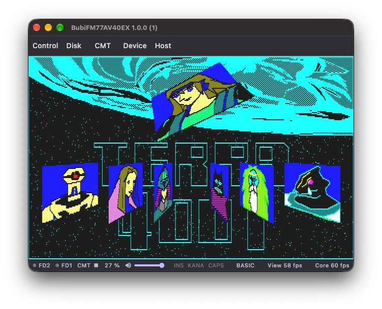

# BubiFM77AV40EX

<p align="center">
  
</p>

[日本語](README.md)

BubiFM77AV40EX is a multi-platform FUJITSU FM77AV40EX emulator.

<p align="center">
  <a href="https://github.com/bubio/BubiFM77AV40EX/releases/latest">
    
  </a>
  <a href="https://github.com/bubio/BubiFM77AV40EX/blob/main/LICENSE">
    
  </a>
  <a href="https://github.com/bubio/BubiFM77AV40EX/actions/workflows/ci.yml">
    
  </a>
  <a href="https://github.com/bubio/BubiFM77AV40EX/actions/workflows/build-macos.yml">
    
  </a>
  <a href="https://github.com/bubio/BubiFM77AV40EX/actions/workflows/build-windows.yml">
    
  </a>
  <a href="https://github.com/bubio/BubiFM77AV40EX/actions/workflows/build-linux.yml">
    
  </a>
  <a href="https://github.com/bubio/BubiFM77AV40EX/releases/latest">
    
  </a>
</p>

## About BubiFM77AV40EX

BubiFM77AV40EX is a multi-platform FM77AV40EX emulator built on the eFM77AV40EX emulation core from Takeda Toshiya's [Common Source Code Project](https://takeda-toshiya.my.coocan.jp/common/index.html).

The emulation core is used unmodified and is called through FFI from a front end written in Flutter. macOS, Windows, and Linux are supported.

The UI is available in Japanese and English.

<p align="center">
  
</p>

## Installation

Download the executable for your platform from the [Releases](https://github.com/bubio/BubiFM77AV40EX/releases/latest) page. Assets are named `BubiFM77AV40EX-<version>-<platform>-<arch>.<ext>`:

| Platform | Minimum OS version | Format | Architectures |
| --- | --- | --- | --- |
| macOS | macOS 13.5 Ventura | `.dmg` | `apple-silicon`, `intel` |
| Windows | Windows 10 | `.zip` | `x64` |
| Linux (Debian / Ubuntu) | Ubuntu 24.04 or later | `.deb` | `amd64`, `arm64` |
| Linux (Fedora / RHEL / openSUSE) | - | `.rpm` | `x86_64`, `aarch64` |
| Linux (portable) | - | `.AppImage` | `x86_64`, `aarch64` |

- **macOS:** Open the DMG and move `BubiFM77AV40EX.app` to the `Applications` folder or another suitable location, then run it. The app is not signed or notarized; if macOS blocks the first launch, allow it from `System Settings` > `Privacy & Security`.
- **Windows:** Extract the ZIP and run `BubiFM77AV40EX.exe`.
- **Linux:** The GTK 3 and ALSA libraries are required. Install the deb or rpm with your package manager. The AppImage runs directly once it is made executable.

## ROM Files

ROM files are not included. Please prepare ROMs dumped from your own machine.

| File name | Size | Purpose |
| --- | --- | --- |
| `INITIATE.ROM` | 8KB | Required to boot |
| `SUBSYS_A.ROM` | 8KB | Required to boot |
| `SUBSYS_B.ROM` | 8KB | Required to boot |
| `SUBSYS_C.ROM` | 10KB | Required to boot |
| `SUBSYSCG.ROM` | 8KB | Required to boot |
| `EXTSUB.ROM` | 48KB | Required to boot |
| `FBASIC302.ROM` (or `FBASIC301.ROM` / `FBASIC300.ROM` / `FBASIC30.ROM`) | 31KB | Required for BASIC boot mode |
| `KANJI1.ROM` (or `KANJI.ROM`) | 128KB | JIS level 1 kanji (optional) |
| `KANJI2.ROM` | 128KB | JIS level 2 kanji (optional) |
| `DICROM.ROM` | 256KB | Dictionary (optional) |

Without the F-BASIC ROM, the emulator can still boot in DOS mode.

### Location

Place ROM files in the following directory. The directory is created after the application is launched once. You can also open it from the application's ROM check screen.

| OS | Location |
| --- | --- |
| macOS | `~/Library/Application Support/BubiFM77AV40EX/roms` |
| Windows | `%APPDATA%\BubiFM77AV40EX\roms` |
| Linux | `~/.local/share/BubiFM77AV40EX/roms` |

## Usage

### Command-Line Launch

Up to two disk images can be specified on the command line. They are inserted into FD1 and FD2 in the order given.

```shell
BubiFM77AV40EX [-option ...] image-file [image-No] [image-file [image-No]]

BubiFM77AV40EX game.d88
BubiFM77AV40EX game.d88 2
BubiFM77AV40EX system.d88 data.d88
BubiFM77AV40EX -dos -x2 game.d88
```

`image-No` is the 1-based bank number within a multi-bank image such as D88. If it is omitted for a single multi-bank image, bank 1 is inserted into FD1 and bank 2 (if present) into FD2.

Options (case-insensitive; the last one wins for the same setting):

```text
-basic / -dos                       Boot mode
-2mhz / -1.2mhz                     CPU type
-x1 / -x2 / -x4 / -x8 / -x16        Speed multiplier
-fullspeed                          Unrestricted speed
-cycle_steal / -no_cycle_steal      Cycle steal
-extram / -no_extram                Extended RAM
-hsync / -no_hsync                  HSYNC sync
-h / -help / --help                 Show help and exit
```

Exit codes: 0 = success or help, 2 = syntax error, 3 = media error, 4 = ROM/boot error, 5 = internal error.

## Building

[FVM](https://fvm.app/) and Git are required on every platform. Flutter must always be run through FVM, and its version is pinned in `.fvmrc`. The build scripts fetch the emulation core at its pinned revision as a Git submodule.

```shell
git clone https://github.com/bubio/BubiFM77AV40EX.git
cd BubiFM77AV40EX
fvm install
```

During development, run and check the app with:

```shell
fvm flutter run -d <macos|windows|linux>
./scripts/check.sh   # format, static analysis, and tests
```

### macOS

#### Dependencies

Xcode, plus CMake and CocoaPods installed with [Homebrew](https://brew.sh/), are required.

```shell
brew install cmake cocoapods
```

#### Build

```shell
./scripts/build_macos.sh
```

The app bundle is generated at `build/macos/Build/Products/Release/BubiFM77AV40EX.app`.

To create DMGs, run the following. Apple Silicon and Intel DMGs are written to `build/macos/dmg`.

```shell
./scripts/build_macos_dmg.sh arm64 x86_64
```

### Windows

#### Dependencies

Visual Studio 2022 (Desktop development with C++) and Git for Windows are required.

#### Build

Fetch the emulation core in Git Bash, then build in PowerShell.

```shell
./scripts/build_native_core.sh fetch
```

```powershell
pwsh scripts/build_windows.ps1
```

A ZIP file is generated in `build/windows/dist`.

### Linux

#### Dependencies

**Debian-based (Ubuntu, etc. / apt):**

```shell
sudo apt-get install clang cmake ninja-build pkg-config libgtk-3-dev libasound2-dev liblzma-dev libstdc++-12-dev
```

To create packages, `imagemagick`, `desktop-file-utils`, and `rpm` are also required.

#### Build

The build targets the same architecture (x86_64 / arm64) as the build machine.

```shell
./scripts/build_linux.sh release
./scripts/package_linux.sh
```

deb, rpm, and AppImage files are generated in `build/linux/dist`. You can also build a single format, for example `./scripts/package_linux.sh deb`.

## License

This project is licensed under GPLv2, following the license of the Common Source Code Project emulation core. See [LICENSE](LICENSE) for details.

## Acknowledgements

Many thanks to Takeda Toshiya for publishing the emulation core.
